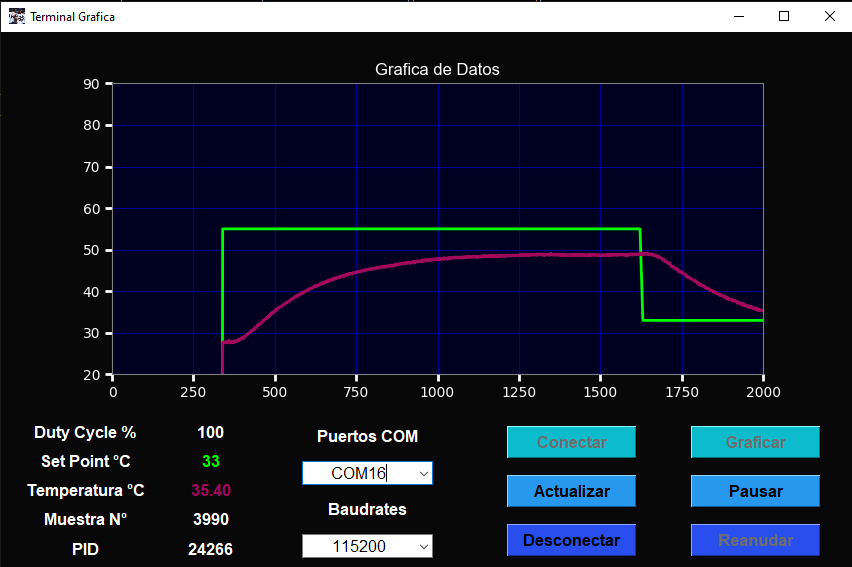
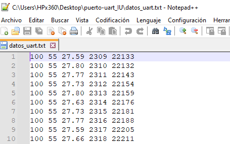

# PUERTO UART CON GUI
## *Implementacion de un puerto uart que grafica los datos de entrada y guardarlos*
   - se grafica dos valores del set point y de la temperatura
   - los valores deben entrada por uart son 5 deben estar serpados por un espacio
   - la primera columna debe ser el valor de ciclo de trabajo
   - la segunda columna debe ser el valor del set point
   - la tercera columna debe ser el valor de la temperatura
   - la cuarta columna dene ser el numero de la muestra
   - la quinta columna debe ser el valor en bruto del PID
   - se crea un archivo de texto llamado "datos_uart.txt" plano al pulsar conectar
   - se empieza a guardar los datos al precionar graficar
   - se cierra el archiv al presionar desconectar, si no se cierra se pierden los datos

### Interface   

### Documento Generado   

